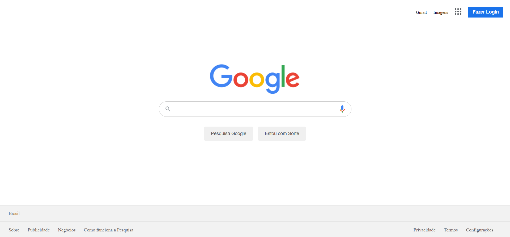

<h1 align="center">
  Clone do site GOOGLE
</h1>

  

## 💻 Projeto

Este projeto é um clone funcional da home page do GOOGLE usando _HTML_,_CSS_ e _JAVASCRIPT_.

## 🚀 Tecnologias

- HTML
- CSS
- JAVASCRIPT
